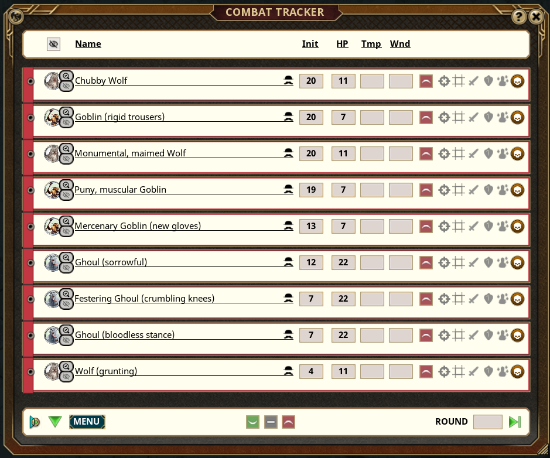

# NPC Flavors v2

Fantasy Grounds Unity, ruleset agnostic, extension that adds template-based descriptive flavors to NPC names in the combat tracker.

**Example:** "Zombie" → "Decayed Zombie (pale flesh)"



## Building the Extension

1. Install dependencies (one-time setup):

   ```powershell
   npm install
   ```

   _(Minimal installation - only 1 package, without a ton of unnecessary node_modules)_

2. Build the extension:
   ```powershell
   npm run build
   ```

The extension package will be created at `build\releases\[version]\npc-flavors.ext`

## Adding Words

Words are organized in `scripts/data/words/` by category. Each file exports a `Data` table with three-level structure: `category.subcategory.archetype`

**Example - Adding physical conditions:**

Edit [scripts/data/words/physical.lua](scripts/data/words/physical.lua):

```lua
Data = {
    conditions = {
        general = { "wounded", "scarred", "battered" },
        undead = { "rotting", "decayed", "risen" },
        construct = { "damaged", "cracked", "corroded" }
    }
}
```

**Available Word Categories:**

| Category      | Subcategories               | Purpose                            | Examples                                   |
| ------------- | --------------------------- | ---------------------------------- | ------------------------------------------ |
| `physical`    | conditions, size, texture   | Physical state and characteristics | wounded, scarred, towering, rough          |
| `appearance`  | colors, features, skin      | Visual appearance                  | crimson, pale, scarlet, ashen              |
| `items`       | clothing, armor, weapons    | Equipment and gear                 | cloak, armor, blade, shield                |
| `anatomy`     | body parts by creature type | Body features and parts            | claws, fangs, tentacles, wings             |
| `behaviors`   | actions, sounds, movements  | Actions and behaviors              | prowling, growling, shuffling, stalking    |
| `social`      | roles, relationships        | Social context                     | alpha, chieftain, scout, veteran           |
| `environment` | terrain, weather            | Environmental context              | rain-soaked, frost-covered, storm-battered |
| `emotions`    | states, expressions         | Emotional state                    | angry, nervous, determined, weary          |

**Archetypes:**

- `general` - applies to all creature types
- `humanoid`, `beast`, `undead`, `construct`, `elemental`, `dragon`, `celestial`, `fiend`, `fey`, `giant`, `plant`, `ooze`, `monstrous` (aberrations + monstrosities)

### Type Aliases

Type aliases enable cross-ruleset compatibility by mapping ruleset-specific type names to standard archetypes. This allows the extension to work seamlessly across D&D 5E, Savage Worlds, Pathfinder, and other rulesets.

**Example:**

Edit [scripts/data/templates/metadata.lua](scripts/data/templates/metadata.lua):

```lua
Data = {
    TemplateTypeAliases = {
        ["beast"] = { "animal", "aquatic" },  -- Maps "animal" to use beast archetype
        ["undead.corporeal"] = { "zombie", "ghoul", "skeleton" }
    }
}
```

## Adding Templates

Templates define flavor patterns for creature types. Each template uses `{category.subcategory.archetype}` placeholders.

**Example - Humanoid templates:**

Edit [scripts/data/templates/humanoid.lua](scripts/data/templates/humanoid.lua):

```lua
Data = {
    {
        pattern = "{physical.conditions.general:capitalize} {name}",
        weight = 40,
        description = "Condition prefix"
    },
    {
        pattern = "{name} ({appearance.colors.general} {items.clothing.general})",
        weight = 30,
        description = "Colored clothing"
    }
}
```

**Weight:** Controls how often each template is selected (higher = more frequent). Weights are relative - a template with weight 40 is twice as likely to be chosen as one with weight 20.

**Result for "Goblin":**

- "Scarred Goblin" (from first template)
- "Goblin (tattered cloak)" (from second template)

**Pattern Modifiers:**

- `{var:capitalize}` - Capitalize first letter
- `{var:upper}` - ALL CAPS
- `{var:article}` - Prepend "a" or "an"

**Special Variables:**

- `{name}` - The NPC's name

## Template Hierarchy

Templates use type-based organization with automatic fallback:

1. `undead.zombie` (most specific - subtype)
2. `undead` (parent type)
3. `generic` (universal fallback)

**Creating subtypes:** Add new template files with dot notation like `undead.intelligent`, `dragon.chromatic`, or `fiend.demon`
